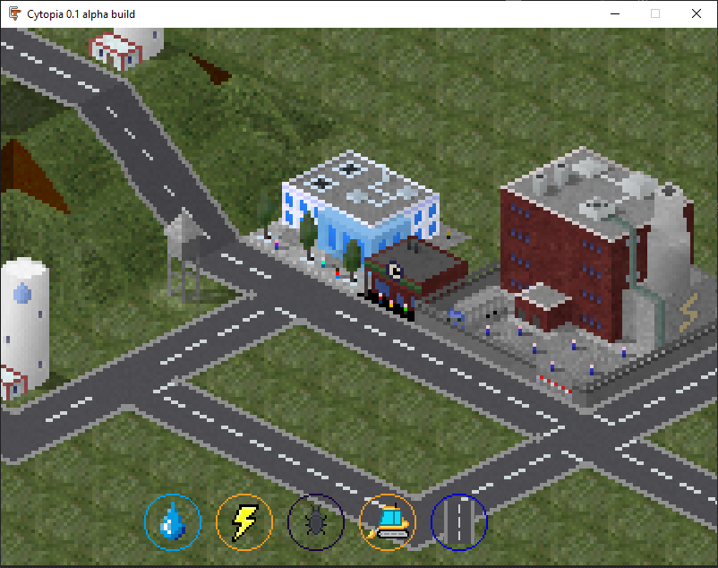
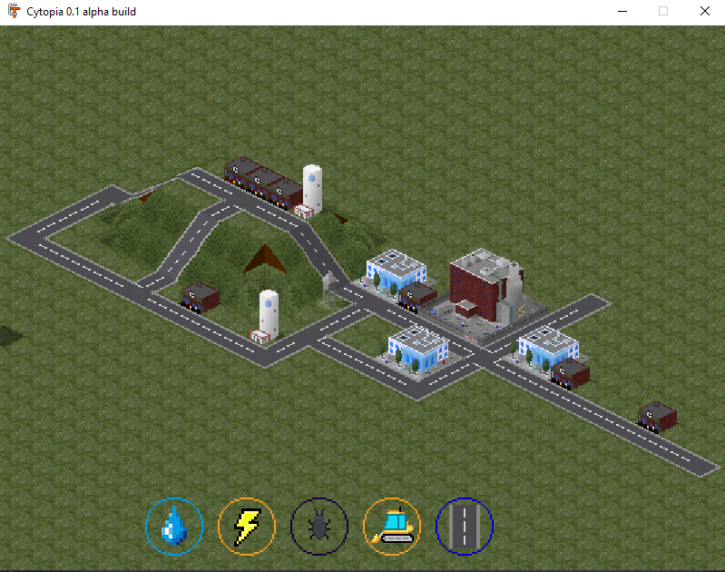

<b>Discord</b> - Cytopia - <https://discord.gg/MG3tgYV6ce> 
<b>Itch io</b> - Cytopia - <https://cytopia.itch.io/cytopia> 
<b>GitHub</b> - Cytopia by CytopiaTeam - <https://github.com/CytopiaTeam/Cytopia> 

Cytopia is a free, open source retro pixel-art city building game with a big focus on mods. It utilizes a custom isometric rendering engine based on SDL2.

#### Current Key Features:
- Custom UI System
- SDL2 based rendering engine written in C++
- Camera panning, zooming, relocating
- Terrain manipulation
- Procedural Terrain Generation
- Pixel-art graphics made by graphics team lead by Kingtut 101
- An original soundtrack, ambient noises, and sound effects made mostly by MB22
- A Qt based tile editor for editing TileData JSON files

#### Planned features:
- Biomes
- OpenGL Renderer
- Gameplay mechanics
- In-Game Mod downloading mechanism
- Android / iOS
- Scripting language for mods (like LUA)

For code documentation, see the project's [Doxygen Documentation](https://cytopia-docs.netlify.app/).

If you have questions or if you want to join the project, visit the [Project's Discord Server](https://discord.gg/qwa2H3G).
If Discord is not for you, visit our IRC channel on freenode at #Cytopia

#### Supported Platforms
Linux (clang / g++-5 or higher)
Windows
Mac

#### Prerequisites

- [CMake](https://cmake.org/)
- [Conan](https://conan.io)
- [SDL2](https://www.libsdl.org/)
- [SDL2_tff](https://www.libsdl.org/)
- [SDL2_image](https://www.libsdl.org/)
- [OpenAL](https://www.openal.org/)
- [zlib](https://www.zlib.net/)
- [libnoise](http://libnoise.sourceforge.net/)
- [libogg](https://www.xiph.org/ogg/)
- [libvorbis](https://www.xiph.org/vorbis/)
- [libpng](http://www.libpng.org/pub/png/libpng.html)
- [imgui](https://github.com/ocornut/imgui)

#### Build instructions

See: <https://github.com/CytopiaTeam/Cytopia/wiki/Build-instructions>

#### Coding guidelines

See: <https://github.com/CytopiaTeam/Cytopia/wiki/Coding-guidelines>

#### Work-in-Progress Screenshot

